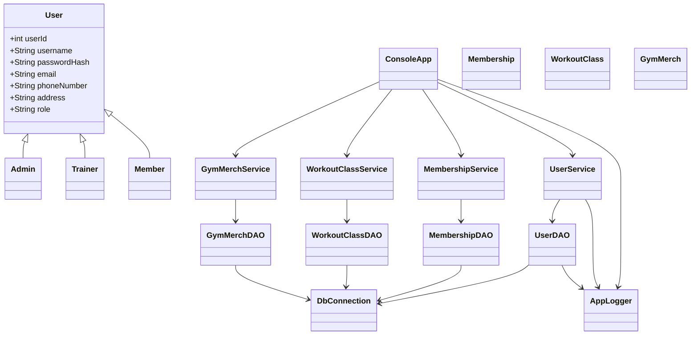
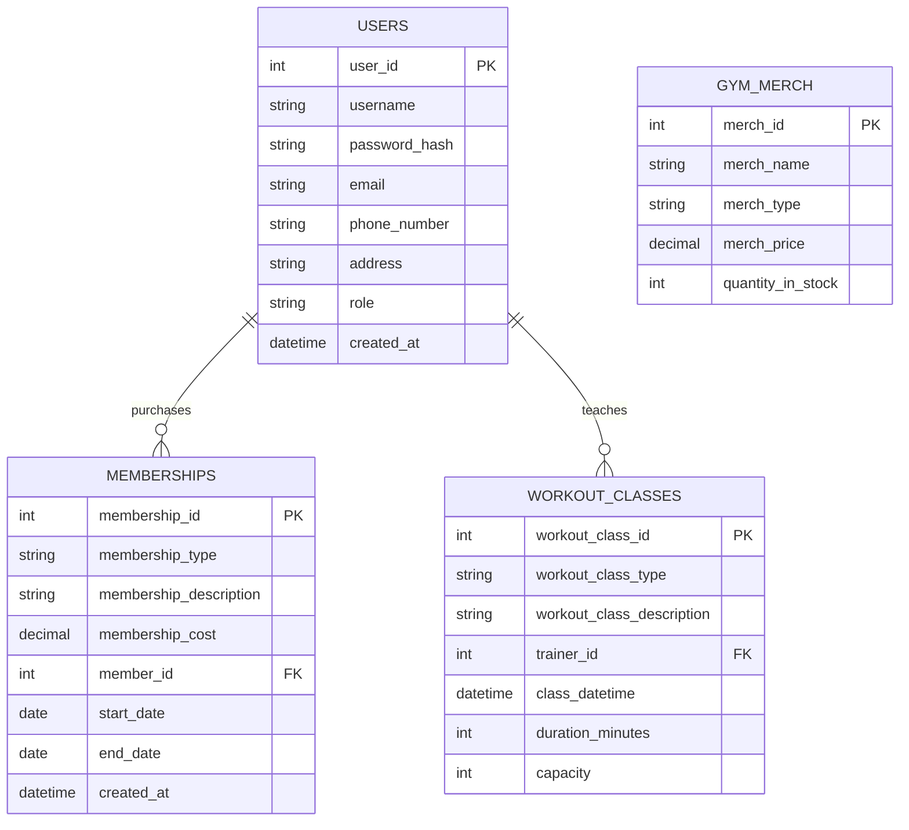

# Gym Management System Developer Guide

This guide is for developers joining the project.

## Architecture Overview
The project uses a layered design.

- Console UI layer: `ConsoleApp`
- Service layer: `UserService`, `MembershipService`, `WorkoutClassService`, `GymMerchService`
- DAO layer: `UserDAO`, `MembershipDAO`, `WorkoutClassDAO`, `GymMerchDAO`
- Database layer: PostgreSQL tables defined in `create_schema.sql`

Flow:
- Console UI collects input
- Service layer applies validation and business rules
- DAO layer executes SQL via JDBC
- Data is persisted in PostgreSQL

## Class Design

### Key classes and responsibilities
- `User`: Base user model
- `Admin`, `Trainer`, `Member`: Role-specific user models extending `User`
- `Membership`, `WorkoutClass`, `GymMerch`: Domain entities
- `DbConnection`: Database connection utility
- `AppLogger`: Logging configuration for file output

### Class Diagram


## Database Design

### Tables and purpose
- `users`: Login/profile data and role
- `memberships`: Membership purchases tied to users
- `workout_classes`: Trainer-owned classes
- `gym_merch`: Merch inventory and pricing

### Relationships
- `memberships.member_id` -> `users.user_id`
- `workout_classes.trainer_id` -> `users.user_id`

### ERD Diagram


## Setup Instructions

### 1) Clone
```bash
git clone https://github.com/PureBoost/Java-Final
cd "Java Final"
```

### 2) Configure PostgreSQL
1. Create a database named `qap4`.
2. Run scripts:
```sql
CREATE DATABASE qap4;
\c qap4
\i create_schema.sql
\i seed_data.sql
```
3. Confirm credentials in `DbConnection.java`.

## Dependencies
- Java JDK
- PostgreSQL
- JDBC driver: `postgresql-42.7.10.jar`
- BCrypt: `jbcrypt-0.4.jar`

Referenced in `.vscode/settings.json`.

## Build and Run
```bash
javac -cp ".;postgresql-42.7.10.jar;jbcrypt-0.4.jar" *.java
java -cp ".;postgresql-42.7.10.jar;jbcrypt-0.4.jar" ConsoleApp
```

## Logging
- Configured in `AppLogger.java`
- Output file: `GymApp.log`
- Logs include startup, authentication events, key actions, and failures

Why logging is used:
- Faster troubleshooting
- Basic activity history for debugging and demos
